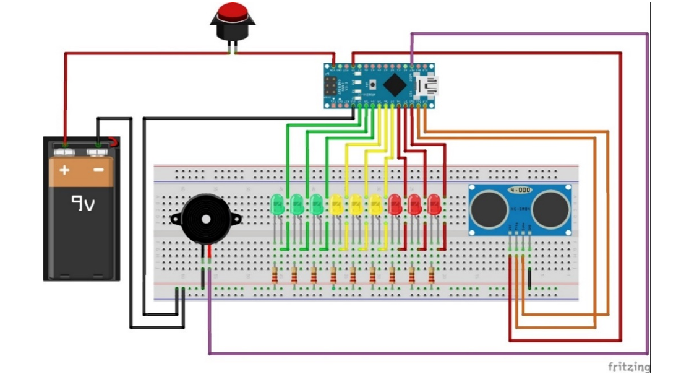

# Arduino Parking Sensor System

A compact and functional **parking assistant system** based on the Arduino Nano platform. It uses an **ultrasonic distance sensor** to detect obstacles and provides **visual and audio feedback** using LEDs and a buzzer. The system is housed in a **custom 3D-printed enclosure** designed in Fusion 360.

---

## Features

- **Distance Detection** using HC-SR04 Ultrasonic Sensor
- **LED Indication**:
  - Green → Safe distance
  - Yellow → Caution
  - Red → Danger (very close)
- **Buzzer Warning** for close obstacles
- **Push Button** to activate/deactivate the system
- **3D-Printed Enclosure** for clean mounting and protection

---

## Components Used

- 1x Arduino Nano
- 1x HC-SR04 Ultrasonic Sensor
- 3x Green LEDs  
- 3x Yellow LEDs  
- 3x Red LEDs  
- 1x Piezo Buzzer  
- 1x Push Button  
- 1x Breadboard and Jumper Wires  
- 9V Battery & Clip  
- Resistors (for LEDs and button)
- Custom-designed 3D-printed case (Fusion 360)

---

## How It Works

1. Press the **button** to activate the sensor.
2. The **HC-SR04** continuously measures the distance to the nearest object.
3. Depending on the measured distance:
   - LEDs light up progressively from green to red.
   - The buzzer beeps faster and louder as the object gets closer.
4. When the button is pressed again, the system turns off.

---

## Enclosure Design

- The enclosure is designed in **Fusion 360** and fits all components.
- It is optimized for **FDM 3D printing** with openings for the ultrasonic sensor, LEDs, button, and power.
- STL and Fusion 360 source files are available in the root` directory.

---

## Circuit Diagram

---

